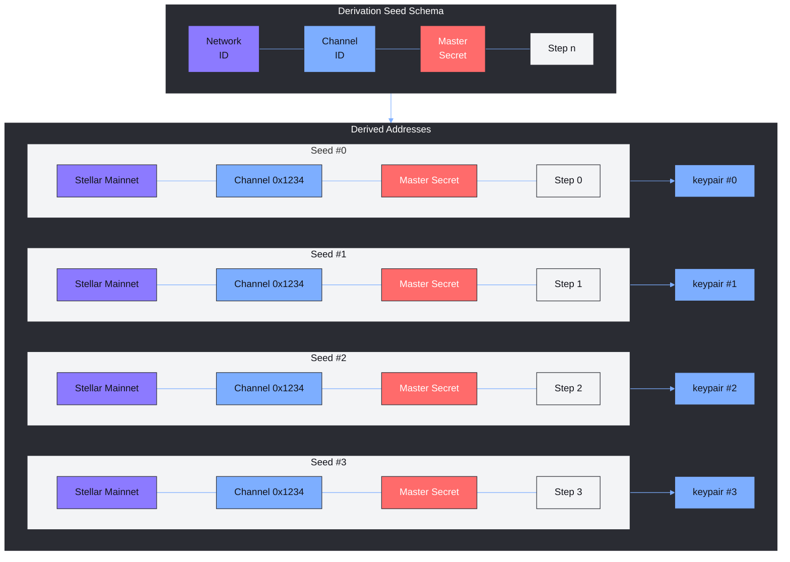

# Client Layer

Any client, whether a wallet application, a payment processor, or an internal service, must implement the mechanisms defined in this section to interact with the Moonlight protocol. A compliant client is able to manage the user’s master account, deterministically derive UTXO addresses, construct and sign transactions, and communicate with authorized privacy providers.&#x20;

The reference Moonlight SDK offers ready-made modules that satisfy these requirements, but custom implementations are acceptable as long as they follow the specification precisely.

### Key Derivation Scheme

Derivation lets a single master secret control an unlimited set of UTXO key pairs while keeping every address bound to the correct network and Privacy Channel. A compliant client feeds this composite seed into the agreed **Key Derivation Function**, which deterministically produces a `secp256r1` key pair. Incrementing the counter yields the next address, giving the application an unlimited, ordered sequence of UTXO keys.

To create each secp256r1 key pair, the client builds a seed by concatenating the following context items in the order shown:

* **Network identifier** – the passphrase that uniquely identifies the target Stellar network.
* **Privacy Channel ID** – the Soroban contract address of the channel.
* **Master secret key** – the user’s root secret.
* **Stepping Suffix** – a unique suffix generated by a step function based on a sequential integer that starts at 0 and increments for every new UTXO address.

The client passes this composite seed to the agreed **Key Derivation Function** (a deterministic cryptographic routine) to obtain one private-public key pair. Incrementing the counter and repeating the function yields the next address, giving the client an ordered sequence of UTXO keys.

_Characteristics of this schema_

* Embedding the network identifier and channel ID in the seed keeps each derived key context-specific, helping wallets organise addresses by network and channel.
* Any conforming client can reproduce the exact address sequence by iterating the counter, making balance recovery straightforward.
* Users need to back up only their single master secret; all UTXO addresses are reproducible whenever needed.
* The schema can evolve and be expanded in future versions of the protocol by managing the underlying elements of the derivation seed.

### **Transaction bundling and signing**

This subsection will define how a client groups user-selected inputs and outputs into a bundle and applies the required signatures so the bundle passes protocol verification in the channel contract.&#x20;

_Work in progress._

### **UTXO management**

This part will describe how a client keeps track of all derived UTXOs, checks their balances and states locally, and presents them to the user as a single aggregated account balance for seamless spending.&#x20;

_Work in progress._

### **Receiving address generation**

When a user plans to receive funds, the client chooses one or more fresh addresses according to a user-defined entropy level, splits the expected amount across those addresses, and encodes the result in a protocol-standard XDR structure ready for sharing with senders.&#x20;

_Work in progress._

### **Privacy provider integration**

This section will specify how a client connects to the standard provider API so that prepared bundles can be relayed by an authorised privacy provider to the channel.&#x20;

_Work in progress._

