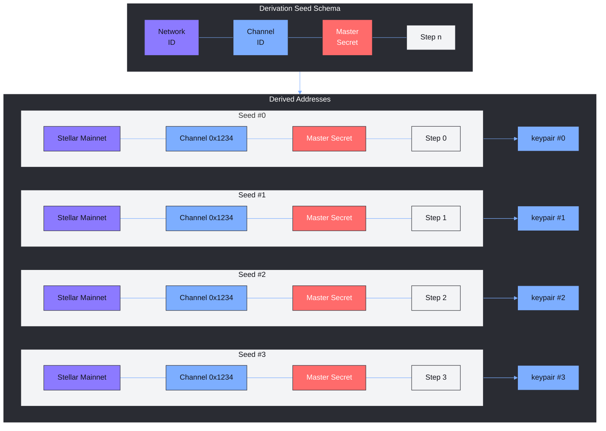

# Client Layer

###

#### Key Derivation Scheme

```mermaid fullWidth="true"

flowchart TB
  TEMPLATE --> ALL
  linkStyle default stroke:#7DAEFF,stroke-width:1.5px           %% Lunar-Ice arrows
	style ALL fill:#2A2C33,stroke:#2A2C33,color:#FFFFFF
	style TEMPLATE fill:#2A2C33,stroke:#2A2C33,color:#FFFFFF
    
  classDef net  fill:#8C7AFF,stroke:#2A2C33,color:#12131A,stroke-width:1px
  classDef ch   fill:#7DAEFF,stroke:#2A2C33,color:#12131A,stroke-width:1px
  classDef sec  fill:#FF6B6B,stroke:#2A2C33,color:#FFFFFF,stroke-width:1px
  classDef step fill:#F3F4F6,stroke:#2A2C33,color:#12131A,stroke-width:1px
  classDef addr fill:#7DAEFF,stroke:#2A2C33,color:#12131A,stroke-width:1px
  classDef box  fill:#F3F4F6,stroke:#2A2C33,color:#E8E9F0

  subgraph TEMPLATE["Derivation Seed Schema"]
    direction LR
    NET["Network<br/>ID"]:::net --- CHA["Channel<br/>ID"]:::ch --- SEC["Master<br/>Secret"]:::sec --- IDX["Step n"]:::step
  end

  subgraph ALL["Derived Addresses"]
    direction LR
    class ALL box

    subgraph SEED0["Seed #0"]
      direction LR
      n0["Stellar Mainnet"]:::net --- c0["Channel 0x1234"]:::ch --- s0["Master Secret"]:::sec --- i0["Step 0"]:::step
    end
    style SEED0 fill:#F3F4F6,stroke:#2A2C33,color:#12131A       %% light-grey seed box
    kp0["keypair #0"]:::addr
    SEED0 --> kp0

    subgraph SEED1["Seed #1"]
      direction LR
      n1["Stellar Mainnet"]:::net --- c1["Channel 0x1234"]:::ch --- s1["Master Secret"]:::sec --- i1["Step 1"]:::step
    end
    style SEED1 fill:#F3F4F6,stroke:#2A2C33,color:#12131A
    kp1["keypair #1"]:::addr
    SEED1 --> kp1

    subgraph SEED2["Seed #2"]
      direction LR
      n2["Stellar Mainnet"]:::net --- c2["Channel 0x1234"]:::ch --- s2["Master Secret"]:::sec --- i2["Step 2"]:::step
    end
    style SEED2 fill:#F3F4F6,stroke:#2A2C33,color:#12131A
    kp2["keypair #2"]:::addr
    SEED2 --> kp2

    subgraph SEED3["Seed #3"]
      direction LR
      n3["Stellar Mainnet"]:::net --- c3["Channel 0x1234"]:::ch --- s3["Master Secret"]:::sec --- i3["Step 3"]:::step
    end
    style SEED3 fill:#F3F4F6,stroke:#2A2C33,color:#12131A
    kp3["keypair #3"]:::addr
    SEED3 --> kp3
  end
```
